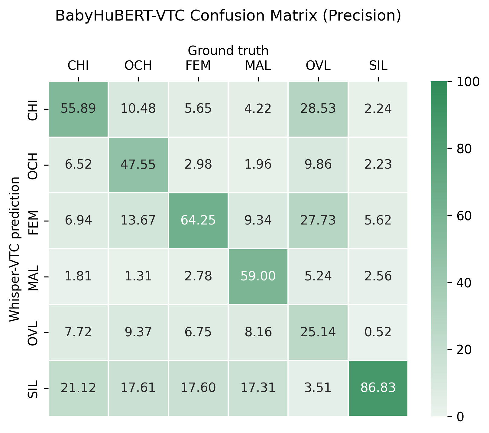
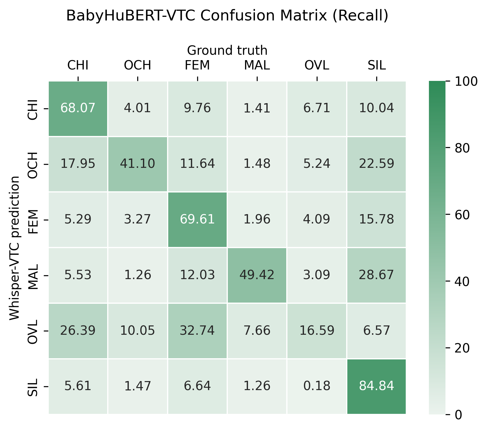

# VTC 2.0 Evaluation

## Runtime
We tested the inference pipeline on multiple GPUs and CPUs and display the expected speedup factors that can be used to estimate the total duration needed to process $x$ hours of audio.

<table>
<tr><th>Table 1: GPU times </th><th>Table 2: CPU times</th></tr>
<tr><td>

| Batch size | Hardware        | Speedup factor |
|:----------:|:----------------|:--------------:|
| 64         | Quadro RTX 8000 | 1/152          |
| 128        | Quadro RTX 8000 | 1/286          |
| 256        | Quadro RTX 8000 | 1/531          |
| 64         | A40             | 1/450          |
| 128        | A40             | 1/358          |
| 256        | A40             | 1/650          |
| 64         | H100            | 1/182          |
| 128        | H100            | 1/466          |
| 256        | H100            | **1/905**      |

</td><td>

| Batch size | Hardware                      | Speedup factor|
|:----------:|:------------------------------|:-------------:|
| 64         | Intel(R) Xeon(R) Silver 4214R | 1/16          |
| 128        | Intel(R) Xeon(R) Silver 4214R | 1/15          |
| 256        | Intel(R) Xeon(R) Silver 4214R | 1/16          |
| 64         | AMD EPYC 7453 28-Core         | 1/20          |
| 128        | AMD EPYC 7453 28-Core         | 1/21          |
| 256        | AMD EPYC 7453 28-Core         | 1/22          |
| 64         | AMD EPYC 9334 32-Core         | 1/25          |
| 128        | AMD EPYC 9334 32-Core         | 1/26          |
| 256        | AMD EPYC 9334 32-Core         | **1/29**      |

</td></tr> </table>

<!-- [297353] seconds in 328.475611 s -->
It takes approximatively $1/905$ of the audio duration to run the model with a batch size of 256 on an H100 GPU.
- For a $1\text{ h}$ long audio, the inference will run for approximatively $\approx 4$ seconds. ($3600 / 905$)
- For a $16\text{ h}$ longform audio, the inference will run for $\approx 1 \text{ minute}$ and $4 \text{ seconds}$. ($16 * 3600 / 905$)

## Model Performance on the heldout set

We evaluate the new model, BabyHuBERT-VTC, on a heldout set and compare it to the previous models and the Human performance (Human 2).

| Model          | KCHI |  OCH |  MAL |  FEM | F1-score |
|----------------|:----:|:----:|:----:|:----:|:--------:|
| Human 2        | 79.7 | 60.4 | 67.6 | 71.5 |   69.8   |
| PyanNet-VTC    | 68.2 | 30.5 | 41.2 | 63.7 |   50.9   |
| Whisper-VTC    | 68.4 | 20.6 | 56.7 | 68.9 |   53.6   |
| BabyHuBERT-VTC | 71.8 | 51.4 | 60.3 | 74.8 |   64.6   |

**Table 1**: F1-scores (%) obtained on the standard test set by
PyanNet-VTC, Whisper-VTC, a second human annotator (Human 2) and the **best BabyHuBERT-VTC** model.

As displayed in table 1, our model performs better than previous iterations with performances close to the Human performances. BabyHuBERT-VTC even surpasses human like performance on the **FEM** class.

## Confusion Matrices on the heldout set
- **OVL**: is the overlap between speakers.
- **SIL**: are the section with silence/noise.

  
   

